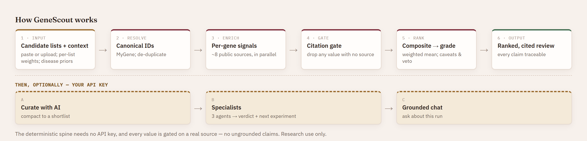

<p align="center">
  
</p>

<h1 align="center">GeneScout</h1>

<p align="center"><em>An agentic evidence-review workbench that investigates candidate gene lists and returns a disease-informed, cited shortlist: the supporting evidence, the uncertainties, and the recommended next steps.</em></p>

<p align="center">
  <a href="https://doi.org/10.5281/zenodo.21352389"></a>
</p>

An agentic evidence-review workbench for research genomics. GeneScout takes a
candidate list (variants, genes, or perturbation hits) plus a biological
context (e.g. *NF1*-associated cancer), and turns it into a **plausibility-ranked
research review**: what each candidate is, what evidence supports it, what is
uncertain, and what experiment or analysis should come next.

> **Research use only.** GeneScout is a hypothesis-prioritization aid for
> researchers. It is **not** a clinical decision-support tool and does not
> provide diagnosis, treatment guidance, or ACMG/AMP variant classification.

---

## The problem

After sequencing, differential expression, or a perturbation screen, you end up
with a long list of candidates. The next step is still painfully manual: you move
between VCFs, annotation tables, pathway databases, PubMed, prior papers, and your
own notes to decide which candidates are worth following up. It is slow, hard to
reproduce, and biased toward genes you already know.

GeneScout compresses that loop. Give it a candidate table and a disease context, and
it returns a transparent, cited, ranked review you can act on, with the
uncertainty made explicit instead of hidden.

## What makes it different

- **Candidate-agnostic input.** Variants, gene symbols, or perturbation hits: the
  same pipeline handles all three.
- **Evidence is grounded, not guessed.** Every claim traces to a database record or
  a citation. Unsupported statements are blocked before they reach the report.
- **A caveats stage that can veto a score.** A candidate that looks compelling but is
  common in the population, supported only by unrelated-tissue evidence, or backed
  by a single weak paper gets flagged and down-ranked. This is the
  anti-familiar-gene-bias mechanism, and it is a first-class stage, not a footnote.
- **Auditable output.** The report is a reviewable artifact: per-candidate scores, the
  evidence behind each score, the caveats, and suggested next experiments.
- **Bring genes from several analyses.** Tag each source by assay (your WES calls,
  significant DEGs, ATAC-seq-enriched genes), and a gene corroborated across more of
  your own sources ranks higher (*breadth beats a single loud source*). An optional
  input agent can clean messy input (typos, aliases, non-genes) and propose a disease
  context up front; it proposes, you confirm, then the deterministic run proceeds.
- **UI-agnostic core.** The engine is plain data-in/data-out R functions
  (`candidate_set` → `run_review_request`), so the same core backs the Shiny app, a
  CLI, and a design-only HTTP API, and could back a Python or React front end.
- **Context-driven, not NF1-locked.** The disease context is a config file; NF1 ships
  as the reference example, but any context can be dropped in.
- **Provider-agnostic.** Orchestration runs on [ellmer](https://ellmer.tidyverse.org/),
  so the LLM provider (Anthropic Claude by default, or OpenAI, Gemini, Bedrock, …) is
  a config change, not a code change.

## How it works

<p align="center">
  
</p>

The **deterministic spine** above is the source of truth and needs no API key. It
resolves each candidate to a canonical id, pulls a per-gene signal from each public
source through thin [httr2](https://httr2.r-lib.org/) clients, passes every value
through a **citation gate** (anything without a source id is dropped), then computes the
weighted composite and applies the caveats/veto stage before assembling the report.

On top of that spine, GeneScout adds an optional
[ellmer](https://ellmer.tidyverse.org/)-based agent layer (needs a key). It **fetches
nothing new**: it reads only the evidence the spine already retrieved and cited. An AI
curator compacts the ranked list, and three specialist agents run in **isolated,
parallel contexts** (`parallel_chat_structured()`) to synthesize a per-gene
plausibility verdict and a suggested next experiment. The agents accelerate
interpretation; they are never the source of truth.

## Data sources

All sources are public and require no API key unless noted. Versions and access
dates are tracked in [`docs/data_sources.md`](docs/data_sources.md) for reproducibility.

| Stage | Source | Used for |
| --- | --- | --- |
| Parse / resolve | MyGene | Symbol → Ensembl / Entrez / UniProt |
| Variant effect | Ensembl VEP | Functional consequence |
| Variant effect | gnomAD | Population frequency (rarity) |
| Variant effect | ClinVar (NCBI E-utilities) | Known significance (evidence, not diagnosis) |
| Pathway & disease | Open Targets Platform | Gene-disease associations |
| Pathway & disease | Reactome | Pathway membership |
| Pathway & disease | STRING | Within-list interaction connectivity |
| Expression | GTEx | Tissue-of-interest expression relevance |
| Literature | Europe PMC | Gene mention count (recall) |
| Literature | PubTator3 | Entity-tagged article count (precision) |

Sources form a **catalog**; each review activates a selected subset (a deselected
source is never queried). Beyond the lean default set above, opt-in connectors span
cancer (cBioPortal, CIViC), gene-disease (ClinGen, UniProt/Swiss-Prot, HPO),
function (Gene Ontology / QuickGO), and structure (PDBe). The in-app **Connectors**
tab lists every source, its domain, its status (default / opt-in / needs a key /
planned), and what it contributes, all rendered from the same catalog the engine uses.
Key-gated databases (OncoKB, COSMIC, DisGeNET, OMIM, DrugBank) are catalog stubs
until their keys are supplied.

## Quickstart

### Requirements

- **R ≥ 4.3** is the only hard requirement. The deterministic ranking, grades,
  caveats/veto, and the report all run with **no API key**.
- *Optional, for the AI stages only:* an LLM provider key (default Anthropic). Copy
  `.Renviron.example` to `.Renviron` and set `ANTHROPIC_API_KEY`, or paste a key in the
  app (BYOK, held only for that browser session). This enables the optional input/final
  curator, the specialist verdicts, and the grounded Chat assistant.

### Install

```bash
git clone https://github.com/samuelbharti/genescout.git
cd genescout
# Restore the exact pinned dependency set from the committed renv.lock.
Rscript -e 'renv::restore()'
```

`renv.lock` pins every dependency (R 4.6.1 + CRAN packages), so a clone reproduces
the tested environment; the same lock drives the Docker build. To regenerate the lock
after changing dependencies, re-run `Rscript dev/init-renv.R` and review the diff.

### Launch the app

```r
shiny::runApp()
```

### Run the pipeline headless

```bash
Rscript dev/run_review.R \
  --input data/examples/nf1_candidates.tsv \
  --context nf1 \
  --out report.html
```

### Run the engine as an HTTP service (usable outside R)

The core engine is UI-agnostic: the source connectors and the selection API are
driven over plain JSON, so a Python / React / any front end can use them with zero
R. The Shiny app, the CLI, and this service all call the same core functions.

```bash
# One-time: install the dev-only server dependency
Rscript -e 'install.packages("plumber")'

# Start the engine (endpoints: GET /catalog, POST /propose, /confirm,
# /resolve-disease, /review). Swagger docs at http://127.0.0.1:8000/__docs__/
Rscript dev/serve.R 8000
```

Then drive it from any language. A client discovers the source **catalog** (each
entry carries `domain`, `default_on`, `available`, `stub`), picks a subset, and
posts a candidate list + that selection to `/review`:

```bash
python dev/engine_client_demo.py     # stdlib-only Python demo (catalog -> review)
dev/engine_client_demo.sh            # the same, raw curl
```

### Evaluation

The eval set is the spine of the method (it hits live APIs, so run it on demand):

```bash
Rscript evals/run_evals.R       # pass/fail: known drivers grade High, passenger vetoed
Rscript evals/run_benchmark.R   # the caveats benchmark (novelty hook, below)
```

`run_benchmark.R` quantifies the contribution: it enriches each case once, then ranks
it **with and without** the deterministic caveats/veto stage. The demonstrable
effect is that a prominent sequencing-artifact gene (TTN) grades **High** among the
NF1 drivers in the no-caveats baseline, and the caveats stage sinks it to **Vetoed,
last**, so the stage measurably changes outcomes, and the benchmark fails if it ever
stops doing so.

## Repository layout

See [`docs/project_structure.md`](docs/project_structure.md) for the full map.

```text
genescout/
├── global.R / ui.R / server.R  # app entry (bslib template)
├── config.yml                  # provider/model per role
├── R/                          # engine + utilities (+ R/tools/ bio-DB clients)
├── modules/ · userInterface/   # Shiny modules + page layouts
├── prompts/ · context/         # agent prompts + disease-context priors
├── data/examples/              # public/synthetic example candidates
├── dev/run_review.R            # headless CLI
├── evals/ · tests/             # ranking benchmark + unit tests
└── docs/                       # data_sources, described_plan, project_structure
```

## Roadmap

See [`PLAN.md`](PLAN.md) for the full phased plan. Near-term:

- [x] Thin vertical slice: candidate list → one source → summary → report
- [x] Multi-source deterministic enrichment + weighted-mean ranking (live sliders)
- [x] Dual-mode discovery: seed genes from a disease, disease-aware scoring
- [x] Scoring rubric + caveats/veto stage (deterministic: FLAGS veto, weak-source)
- [x] Tagged multi-source input (WES · DEGs · ATAC-seq · …) with a UI-agnostic core
- [x] Cross-source corroboration signal: breadth beats a single loud source
- [x] Optional interpretive input agent (propose → confirm → run; never invents genes)
- [x] AI curator: grounded, model-agnostic final compaction
- [x] Shiny UI with per-candidate evidence cards; CLI + design-only HTTP API
- [x] Eval harness on known NF1 biology
- [x] Three parallel specialist agents (grounded synthesis + suggested next
      experiment), layered on the deterministic ranking
- [x] Parallel evidence retrieval for large lists (a bounded [mirai](https://mirai.r-lib.org/)
      worker pool; serial fallback), so a 100+ gene panel ranks in a fraction of the time
- [x] Crash-safe AI stages: the curator/specialist/input LLM calls run in a background
      process, so stopping or refreshing mid-call can't segfault the session
- [ ] Preprint + evaluation write-up

## Citation

If you use GeneScout, please cite it via [`CITATION.cff`](CITATION.cff). A preprint
describing the method and evaluation is planned.

## License

[MIT](LICENSE). Built for *Built with Claude: Life Sciences* (2026).
